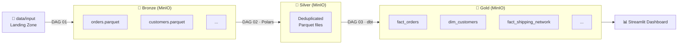
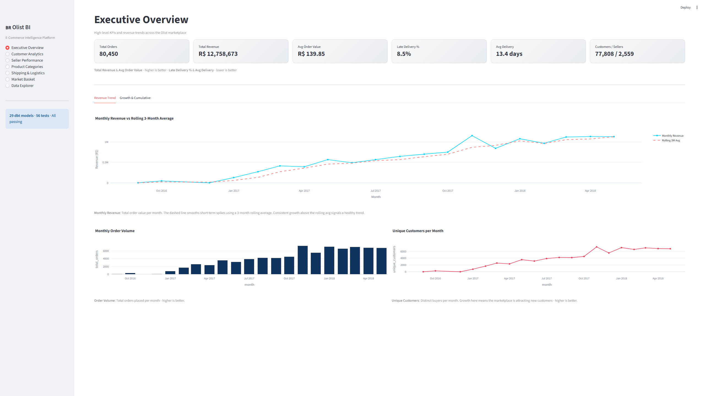

# 🇧🇷 E-Commerce Medallion Pipeline

A fully containerized, end-to-end **Data Engineering Pipeline** built on the [Olist E-Commerce Public Dataset](https://www.kaggle.com/datasets/olistbr/brazilian-ecommerce). It implements a **Medallion Architecture** (Bronze → Silver → Gold) to ingest, clean, and serve analytics-ready data — a "Data Platform in a Box."

---

## 🏗️ Architecture


```mermaid
graph LR
    A[📁 data/input\nLanding Zone] -->|DAG 01| B
    subgraph B["🥉 Bronze (MinIO)"]
        B1[orders.parquet]
        B2[customers.parquet]
        B3[...]
    end
    B -->|DAG 02 · Polars| C
    subgraph C["🥈 Silver (MinIO)"]
        C1[Deduplicated\nParquet files]
    end
    C -->|DAG 03 · dbt| D
    subgraph D["🥇 Gold (MinIO)"]
        D1[fact_orders]
        D2[dim_customers]
        D3[fact_shipping_network]
        D4[...]
    end
    D --> E[📊 Streamlit Dashboard]
```

---

## 📊 Dashboard Preview



> **7 interactive pages** — see the full [Dashboard Guide](docs/dashboard.md) for all screenshots.

---

## 🛠️ Tech Stack

| Layer | Tool | Purpose |
|---|---|---|
| Orchestration | Apache Airflow 2.8.1 | DAG scheduling & task management |
| Storage | MinIO (S3-compatible) | Data Lake for all layers |
| Processing (Silver) | Polars | Fast dataframe deduplication |
| Processing (Gold) | dbt + DuckDB | SQL dimensional modeling via dbt-duckdb |
| Visualization | Streamlit + PyDeck + Plotly | 7-page BI Dashboard with 3D shipping map |
| Infrastructure | Docker Compose | Containerized local environment |
| Metadata DB | PostgreSQL 13 | Airflow backend |

---

## 🚀 Quick Start

### Prerequisites
- [Docker Desktop](https://www.docker.com/products/docker-desktop/)
- [Python 3.9+](https://www.python.org/)
- Olist dataset CSVs placed in `data/raw_kaggle/` (download from [Kaggle](https://www.kaggle.com/datasets/olistbr/brazilian-ecommerce))

### 1. Clone & Configure
```bash
git clone <your-repo-url>
cd olist-pipeline
```

Create a `.env` file in the project root:
```env
MINIO_ROOT_USER=admin
MINIO_ROOT_PASSWORD=password
POSTGRES_USER=airflow
POSTGRES_PASSWORD=airflow
```

### 2. Start Infrastructure
```bash
docker-compose up -d
```

Wait ~60 seconds for all services to initialize, then verify:

| Service | URL |
|---|---|
| Airflow | http://localhost:8081 |
| MinIO | http://localhost:9001 |

### 3. Simulate & Run the Pipeline

**Step 1:** Generate the first batch of daily data:
```bash
python scripts/simulate_stream.py --mode daily
```

**Step 2:** In the Airflow UI, trigger the DAGs in order:
1. `01_ingest_bronze`
2. `02_process_silver`
3. `03_process_gold`

**Step 3:** Run the dashboard:
```bash
pip install streamlit plotly pydeck duckdb
streamlit run scripts/dashboard.py
```

---

## 📁 Project Structure

```
olist-pipeline/
├── dags/                        # Airflow DAGs
│   ├── 01_ingest_bronze.py      # Raw CSV → MinIO Bronze
│   ├── 02_process_silver.py     # Deduplicate → MinIO Silver
│   └── 03_process_gold.py       # dbt run → MinIO Gold
├── dbt_project/                 # dbt models (Gold layer) — 29 models, 57 tests
│   ├── models/
│   │   ├── staging/             # Views on Silver Parquet (8 models)
│   │   ├── marts/               # Dimensions & Fact tables (12 models)
│   │   └── data_products/       # Analytical reports (9 models)
│   ├── tests/                   # Custom dbt tests
│   │   ├── generic/not_empty.sql
│   │   └── assert_gold_models_not_empty.sql
│   ├── dbt_project.yml
│   └── profiles.yml
├── scripts/
│   ├── simulate_stream.py       # Daily/backfill data generator
│   ├── backfill_data.py         # Bulk historical data loader
│   └── dashboard.py             # Streamlit BI dashboard (7 pages)
├── config/
│   └── duckdb/                  # DuckDB configuration
├── data/
│   ├── raw_kaggle/              # Source CSVs from Kaggle
│   ├── input/                   # Daily landing zone (watched by Airflow)
│   └── archive/                 # Processed files archive
├── docker-compose.yaml
├── requirements.txt
└── .env                         # Credentials (not committed)
```

---

## 📚 Documentation

| Doc | Description |
|---|---|
| [Setup Guide](docs/setup.md) | Detailed environment setup walkthrough |
| [Architecture](docs/architecture.md) | Medallion layers, schemas, and technology rationale |
| [DAG Reference](docs/dag_reference.md) | All Airflow DAGs explained |
| [Data Simulation](docs/data_simulation.md) | How to use `simulate_stream.py` |
| [Dashboard Guide](docs/dashboard.md) | How to run and use the Streamlit dashboard |

---

## 🗺️ Roadmap

- [x] Implement dbt project for Gold transformations (dbt-duckdb)
- [x] Add dbt tests (`unique`, `not_null`, custom `not_empty`) — 57 tests, all passing
- [x] Add `dim_products`, `dim_geolocation`, and `dim_date` to the Gold layer
- [x] Add `fact_order_items`, `fact_payments`, `fact_reviews`, `snapshot_daily_seller_backlog`
- [x] Build data products: RFM segmentation, seller performance, cohort retention, revenue trends, customer LTV, market basket analysis
- [x] Build 7-page Streamlit BI dashboard with dark theme and interactive filters
- [ ] Add data quality checks / alerting in Airflow
- [ ] Add idempotency guard (skip re-ingesting already-uploaded partitions)

