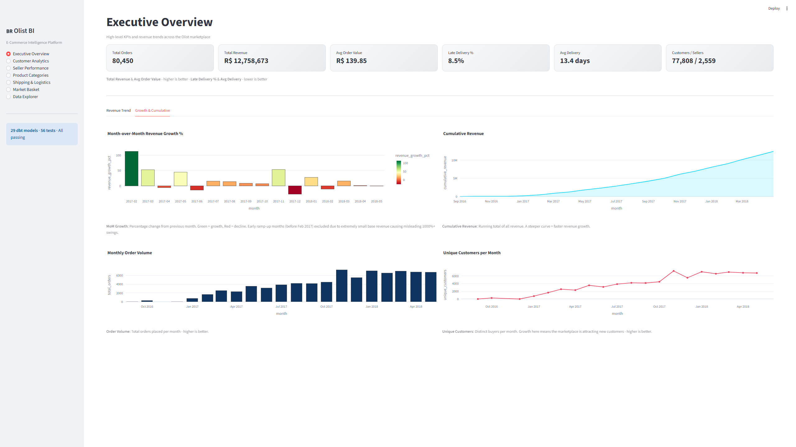
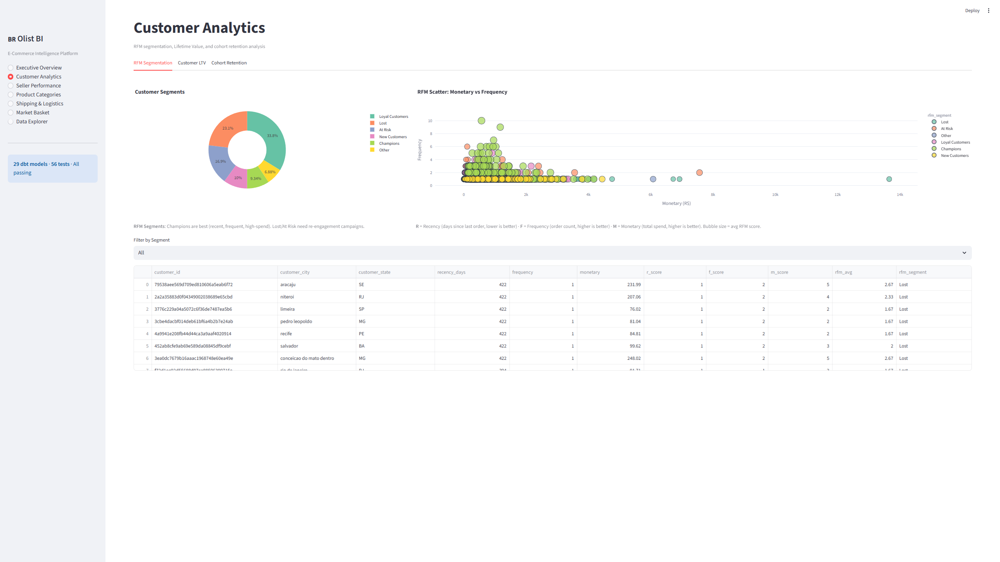
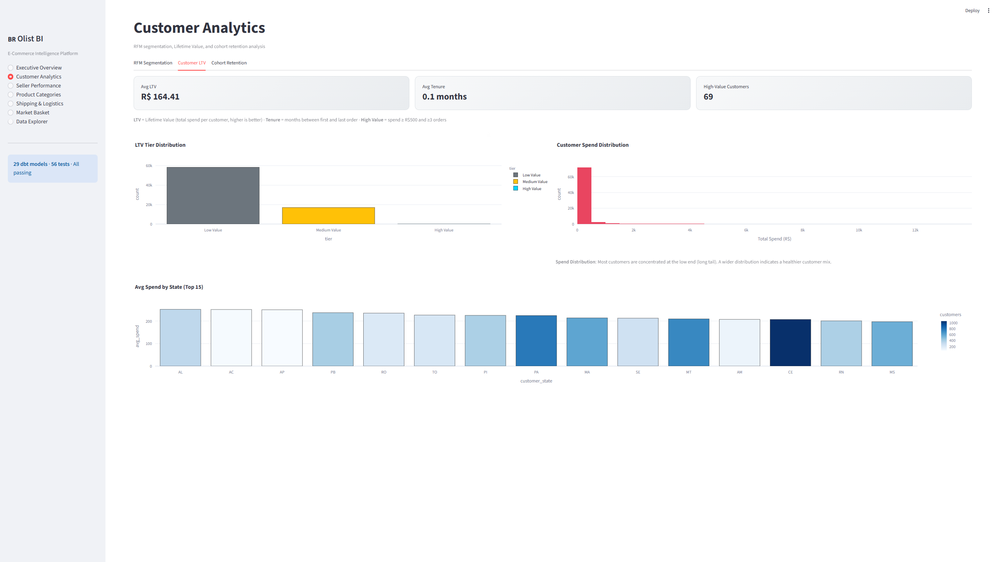
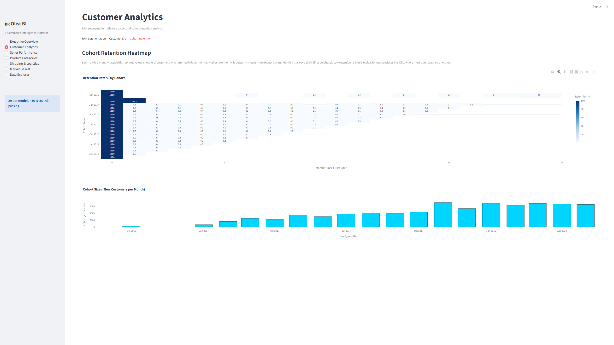
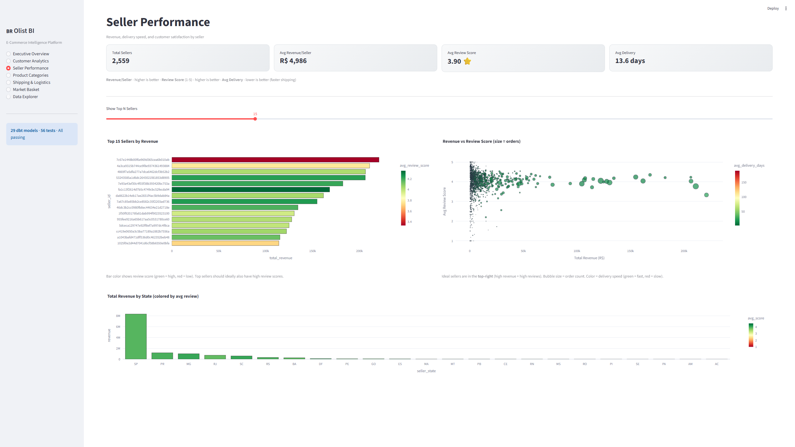
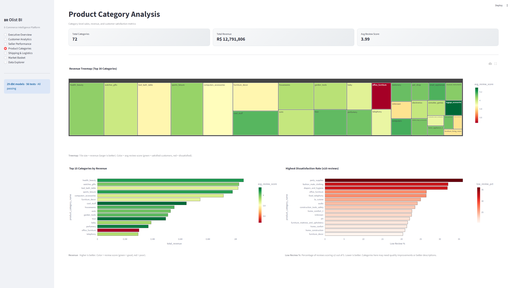
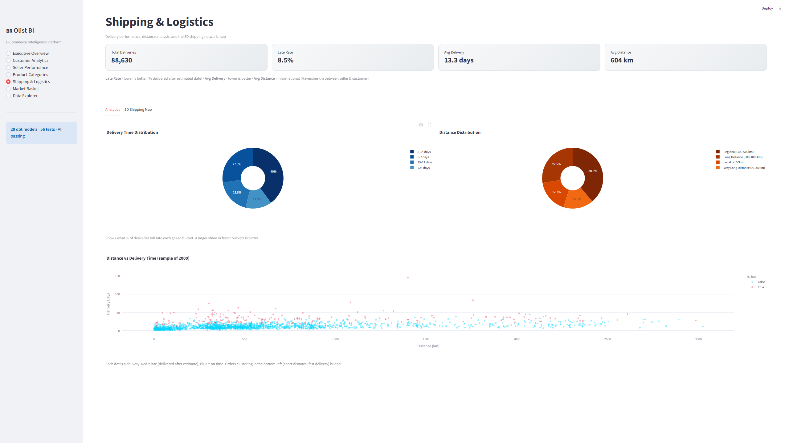
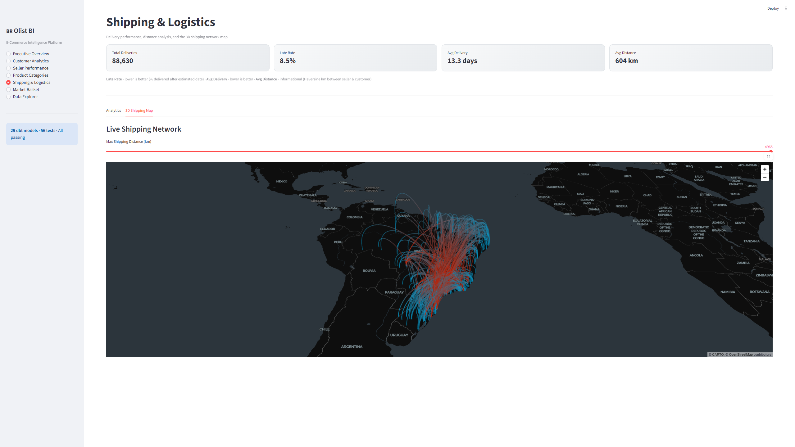
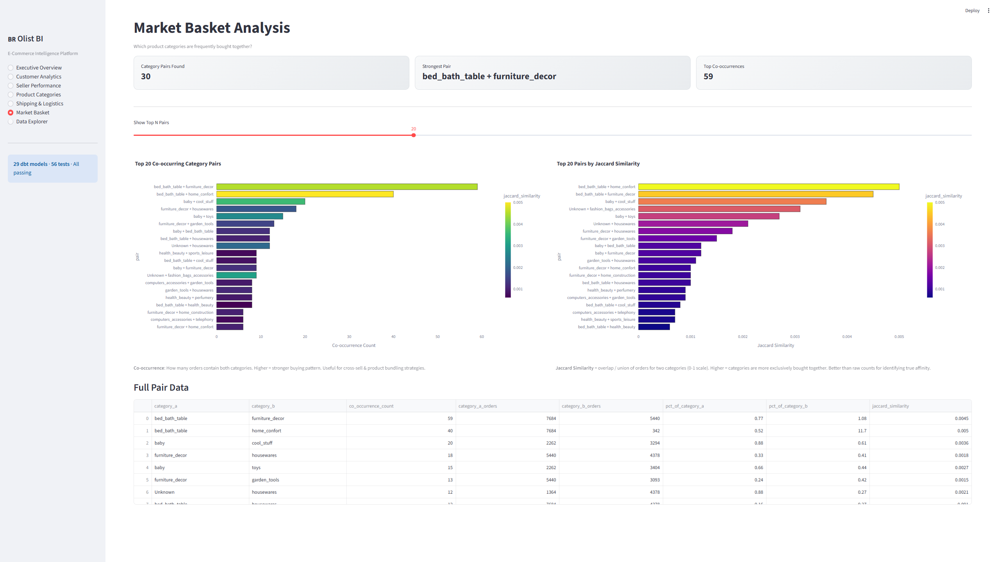
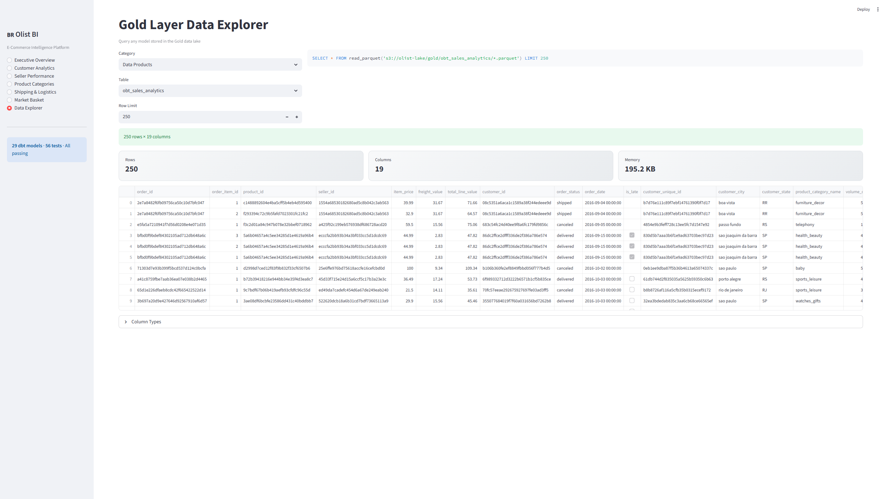

# 📊 Streamlit Dashboard Guide

The project includes an interactive BI dashboard built with **Streamlit**, **Plotly**, and **PyDeck**. It connects directly to the Gold Data Lake in MinIO via DuckDB and requires no additional infrastructure.

---

## Prerequisites

1. Docker services are running (`docker-compose up -d`)
2. The Gold layer has been populated by running all three DAGs at least once
3. Dashboard Python dependencies are installed:

```bash
pip install streamlit plotly pydeck duckdb pandas
```

---

## Running the Dashboard

```bash
streamlit run scripts/dashboard.py
```

Opens at **http://localhost:8501** automatically.

---

## Dashboard Pages

Navigation is via the sidebar radio menu. Each page covers a different area of the business.

### 1. 📊 Executive Overview

| Component | Source | Description |
|---|---|---|
| 6 KPI Cards | `fact_orders`, `fact_order_items`, `fact_order_lifecycle`, `dim_customers`, `dim_sellers` | Total orders, revenue, AOV, late rate, avg delivery, customer/seller counts |
| Revenue Trend | `rpt_revenue_trends` | Monthly revenue line with rolling 3-month average |
| MoM Growth | `rpt_revenue_trends` | Bar chart of month-over-month revenue growth % (excludes ramp-up period) |
| Cumulative Revenue | `rpt_revenue_trends` | Area chart of running total revenue |
| Order Volume | `rpt_revenue_trends` | Monthly order counts |
| Unique Customers | `rpt_revenue_trends` | Distinct buyers per month |




### 2. 👥 Customer Analytics (3 sub-tabs)

| Sub-tab | Source | Visualizations |
|---|---|---|
| **RFM Segmentation** | `rpt_customer_rfm` | Donut chart of segments, scatter (monetary vs frequency, size = RFM score), filterable table |
| **Customer LTV** | `rpt_customer_ltv` | LTV tier bar, spend histogram, avg spend by state |
| **Cohort Retention** | `rpt_cohort_retention` | Retention rate heatmap by cohort month, cohort size bar chart |





### 3. 🏪 Seller Performance

| Component | Source | Description |
|---|---|---|
| 4 KPI Cards | `rpt_seller_performance` | Total sellers, avg revenue, avg review, avg delivery |
| Top-N Revenue Bars | `rpt_seller_performance` | Horizontal bars colored by review score, N controlled by slider |
| Revenue vs Review Scatter | `rpt_seller_performance` | Bubble size = orders, color = delivery speed |
| State Revenue Bars | `rpt_seller_performance` | Aggregated by state, colored by avg review |



### 4. 📦 Product Categories

| Component | Source | Description |
|---|---|---|
| Revenue Treemap | `rpt_product_category_analysis` | Top 30 categories by revenue, colored by review score |
| Top 15 Revenue Bars | `rpt_product_category_analysis` | Horizontal bars colored by review score |
| Dissatisfaction Rate | `rpt_product_category_analysis` | Categories with highest % of low reviews (≤2/5) |



### 5. 🚚 Shipping & Logistics (2 sub-tabs)

| Sub-tab | Source | Visualizations |
|---|---|---|
| **Analytics** | `rpt_shipping_efficiency` | Delivery time donut, distance donut, distance vs delivery scatter (color = late) |
| **3D Shipping Map** | `fact_shipping_network` | PyDeck ArcLayer: 🔴 seller → 🔵 customer, distance slider filter, 2000 route limit |




### 6. 🔗 Market Basket

| Component | Source | Description |
|---|---|---|
| Co-occurrence Bars | `rpt_market_basket` | Top-N pairs by co-occurrence count (slider control) |
| Jaccard Similarity Bars | `rpt_market_basket` | Same pairs ranked by Jaccard similarity |
| Full Data Table | `rpt_market_basket` | All category pairs with counts and similarity |



### 7. 🗄️ Data Explorer

Browse any of the 21 Gold layer tables (dimensions, facts, data products) with:
- Category/table dropdown selectors
- Configurable row limit (10–1000)
- Column type inspector (expandable)
- Memory usage stats



---

## Configuration

Connection settings are at the top of `scripts/dashboard.py`:

```python
SET s3_endpoint='localhost:9000';
SET s3_access_key_id='admin';
SET s3_secret_access_key='password';
SET s3_use_ssl=false;
SET s3_url_style='path';
```

> Update these if you've changed MinIO credentials in `.env`.

---

## Caching

- `@st.cache_resource` - DuckDB connection (created once per session)
- `@st.cache_data` - Query results (cached until app restart)

To force a data refresh, use **"Clear cache"** in the Streamlit menu (top-right `⋮`).

---

## Design

- **Dark theme** with custom CSS (`plotly_dark` template, gradient metric cards)
- **Interactive filters**: sliders, dropdowns, segment selectors
- **Chart descriptions**: Each chart has a 📌 caption explaining the metric and whether higher/lower is better
