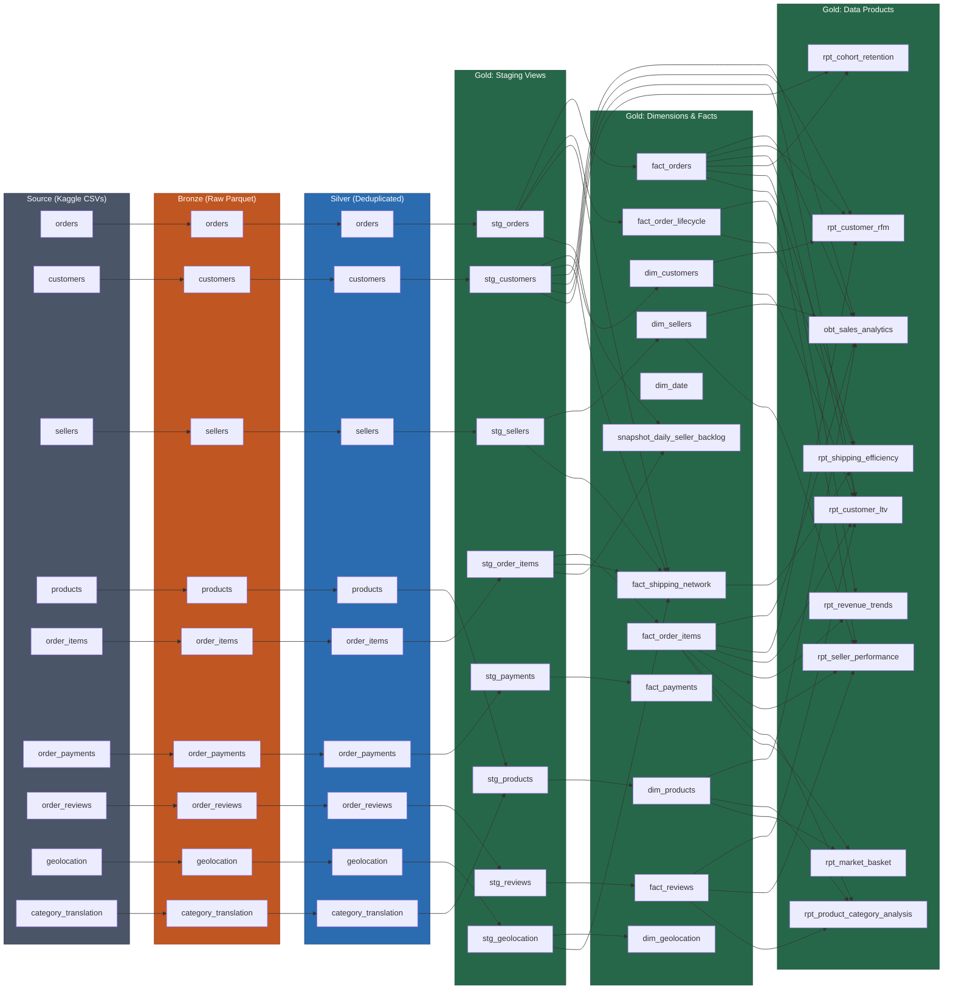

# Data Lineage Diagram

Full end-to-end lineage from Kaggle source files through the Medallion Architecture (Bronze → Silver → Gold).

## Layer Summary

| Layer | Airflow DAG | Storage | Count | Description |
|-------|------------|---------|-------|-------------|
| **Source** | - | `data/raw_kaggle/` | 9 tables | Kaggle CSV dataset |
| **Bronze** | `01_ingest_bronze` | `s3://olist-lake/bronze/` | 9 tables | Raw Parquet upload to MinIO |
| **Silver** | `02_process_silver` | `s3://olist-lake/silver/` | 9 tables | Polars deduplication |
| **Gold: Staging** | `03_process_gold` | DuckDB views | 8 views | dbt staging (type casting, renaming) |
| **Gold: Marts** | `03_process_gold` | `s3://olist-lake/gold/` | 12 tables | Dimensions, facts, snapshot |
| **Gold: Products** | `03_process_gold` | `s3://olist-lake/gold/` | 9 tables | Analytics-ready reports & OBT |
